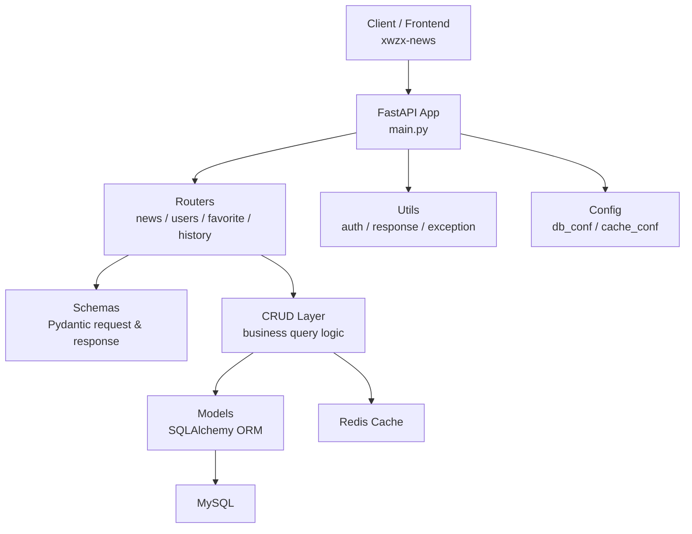

# Toutiao-News

一个以 **FastAPI 后端接口开发** 为核心的新闻资讯练手项目。

本项目重点在后端服务本身，主要用于学习和实践：

- FastAPI 项目组织方式
- RESTful 接口设计
- 异步数据库访问
- Redis 缓存
- 用户注册登录与鉴权
- FastAPI 自动接口文档

仓库中虽然包含 `xwzx-news` 前端目录，但它主要用于页面联调和接口展示，是辅助部分，不是本项目的核心内容。

## 目录

- [项目简介](#项目简介)
- [核心功能](#核心功能)
- [技术栈](#技术栈)
- [快速启动](#快速启动)
- [FastAPI 自动文档](#fastapi-自动文档)
- [项目结构图](#项目结构图)
- [项目结构](#项目结构)
- [后端分层说明](#后端分层说明)
- [主要接口](#主要接口)
- [配置位置](#配置位置)
- [推荐阅读顺序](#推荐阅读顺序)

## 项目简介

这是一个围绕新闻资讯场景搭建的后端项目，后端使用 `FastAPI + SQLAlchemy Async + MySQL + Redis`，实现了新闻分类、新闻列表、新闻详情、用户注册登录、收藏、历史记录等常见业务模块。

这个项目比较适合：

- 想系统了解 FastAPI 项目怎么落地的人
- 想练习接口开发和数据库联动的人
- 想学习 FastAPI 自带文档调试方式的人
- 想把它作为课程项目或作品集项目的人

## 核心功能

### 新闻模块

- 获取新闻分类
- 获取新闻分页列表
- 获取新闻详情
- 阅读量自增
- 获取同分类相关新闻推荐

### 用户模块

- 用户注册
- 用户登录
- 获取当前用户信息
- 修改用户资料
- 修改用户密码

### 收藏模块

- 检查是否已收藏
- 添加收藏
- 取消收藏
- 获取收藏列表
- 清空收藏

### 历史记录模块

- 添加浏览历史
- 获取浏览历史
- 删除单条历史记录
- 清空历史记录

## 技术栈

这部分可以重点看，因为它基本对应了整个项目的核心能力。

### 后端框架

- `FastAPI`
  用于定义路由、处理请求、依赖注入、参数校验和自动生成接口文档，是整个后端项目的核心框架。

- `Uvicorn`
  作为 ASGI 服务启动器，用于本地开发运行 FastAPI 项目。本项目后端的标准启动方式就是：

```bash
uvicorn main:app --reload
```

### 数据库相关

- `MySQL`
  作为主要业务数据库，存储新闻、分类、用户、收藏、历史记录等数据。

- `SQLAlchemy 2.x`
  用于 ORM 建模和数据库操作，项目中采用了异步写法来配合 FastAPI。

- `AsyncSession`
  在每次请求中管理异步数据库会话，负责事务提交和回滚。

- `aiomysql`
  作为 MySQL 的异步驱动，配合 SQLAlchemy 异步引擎使用。

### 缓存相关

- `Redis`
  用于缓存新闻分类和新闻列表，减少数据库重复查询压力，提升接口响应效率。

### 数据校验与安全

- `Pydantic`
  用于请求参数校验、响应结构定义和数据序列化。

- `Passlib + bcrypt`
  用于用户密码加密和密码校验，避免明文存储密码。

### 前端辅助部分

- `Vue 3`
- `Vite`
- `Vant`
- `Pinia`
- `Vue Router`

这些前端技术主要用于提供一个可运行的联调页面，帮助后端接口展示和测试，不是本项目的讲解重点。

## 快速启动

这是使用本项目时最重要的部分。

### 1. 进入后端项目目录

请先进入 `main.py` 所在目录：

```bash
cd E:\python_study\toutiao_backend
```

### 2. 启动后端

执行：

```bash
uvicorn main:app --reload
```

这就是本项目后端的标准启动方式。

启动成功后，默认可访问：

- 首页测试地址：[http://127.0.0.1:8000/](http://127.0.0.1:8000/)
- Swagger 文档：[http://127.0.0.1:8000/docs](http://127.0.0.1:8000/docs)
- ReDoc 文档：[http://127.0.0.1:8000/redoc](http://127.0.0.1:8000/redoc)

### 3. 启动前端

前端不是主角，但如果你需要进行页面联调，需要在前端目录中单独打开终端执行：

```bash
cd E:\python_study\toutiao_backend\xwzx-news
npm run dev
```

如果你使用的是 PyCharm，可以理解为：

1. 打开 `xwzx-news` 文件夹
2. 在这个前端文件夹里打开终端
3. 执行 `npm run dev`

前端的主要作用是调用和展示后端接口数据。

## FastAPI 自动文档

本项目使用 FastAPI，因此具备非常方便的自动接口文档能力。

后端启动后，可以直接访问：

- Swagger UI：[http://127.0.0.1:8000/docs](http://127.0.0.1:8000/docs)
- ReDoc：[http://127.0.0.1:8000/redoc](http://127.0.0.1:8000/redoc)

推荐优先使用 Swagger UI，也就是 `/docs`，因为它可以：

- 直接查看所有接口
- 查看请求参数结构
- 查看返回结果
- 在线测试接口
- 适合学习和前后端联调

如果你想快速确认项目有没有正常跑起来，最直接的方法就是启动后打开 `/docs`。

## 项目结构图

下面这张图可以帮助快速理解这个项目的层次关系：



你可以把它理解成这样一条链路：

```text
请求进入 FastAPI
-> 路由分发
-> 参数校验
-> 业务处理
-> 数据库/缓存访问
-> 统一响应返回
```

## 项目结构

```text
toutiao_backend/
├─ main.py
├─ config/
│  ├─ db_conf.py
│  └─ cache_conf.py
├─ routers/
│  ├─ news.py
│  ├─ users.py
│  ├─ favorite.py
│  └─ history.py
├─ crud/
├─ models/
├─ schemas/
├─ utils/
├─ cache/
└─ xwzx-news/
```

## 后端分层说明

### `main.py`

项目启动入口，负责：

- 创建 FastAPI 应用
- 注册中间件
- 注册异常处理
- 挂载业务路由

### `routers`

接口层，直接面向 HTTP 请求。这里定义了每个业务模块的接口路径、请求方式和参数入口。

### `schemas`

数据校验层，主要使用 Pydantic 来约束请求体和响应体结构，保证接口输入输出更清晰。

### `crud`

业务数据处理层，负责数据库查询、更新、分页、缓存读取等逻辑，是接口实现的核心部分。

### `models`

数据库模型层，使用 SQLAlchemy ORM 来描述表结构和字段关系。

### `config`

配置层，主要包含 MySQL 和 Redis 的基础连接配置。

### `utils`

公共工具层，包含：

- 用户鉴权
- 密码处理
- 统一响应封装
- 全局异常处理

### `cache`

缓存封装层，用于管理新闻分类和新闻列表的 Redis 缓存逻辑。

## 主要接口

### 新闻接口

- `GET /api/news/categories`
- `GET /api/news/list`
- `GET /api/news/detail`

### 用户接口

- `POST /api/user/register`
- `POST /api/user/login`
- `GET /api/user/info`
- `PUT /api/user/update`
- `PUT /api/user/password`

### 收藏接口

- `GET /api/favorite/check`
- `POST /api/favorite/add`
- `DELETE /api/favorite/remove`
- `GET /api/favorite/list`
- `DELETE /api/favorite/clear`

### 历史记录接口

- `POST /api/history/add`
- `GET /api/history/list`
- `DELETE /api/history/delete/{history_id}`
- `DELETE /api/history/clear`

更详细的参数、请求体、响应示例，请直接查看：

- [http://127.0.0.1:8000/docs](http://127.0.0.1:8000/docs)

## 配置位置

几个最常用的文件如下：

- 后端入口：[main.py](E:/python_study/toutiao_backend/main.py)
- 数据库配置：[db_conf.py](E:/python_study/toutiao_backend/config/db_conf.py)
- Redis 配置：[cache_conf.py](E:/python_study/toutiao_backend/config/cache_conf.py)
- 前端接口地址：[api.js](E:/python_study/toutiao_backend/xwzx-news/src/config/api.js)

## 推荐阅读顺序

如果你是第一次看这个项目，推荐按这个顺序理解：

1. 先看 [main.py](E:/python_study/toutiao_backend/main.py)
2. 再看 `routers` 目录
3. 再看 `schemas` 目录
4. 再看 `crud` 目录
5. 最后配合 `/docs` 实际调试接口

这样会更容易看明白一个 FastAPI 后端项目从“启动入口”到“业务实现”的完整链路。
